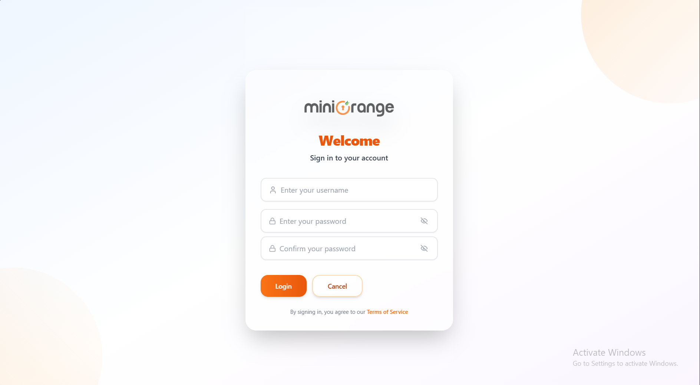

# MiniOrange Login React App



A beautiful, modern login page inspired by MiniOrange, built with React and Tailwind CSS. Features a responsive design, glassmorphism, dark/light theme toggle, and a professional look matching MiniOrange branding.

## Features
- MiniOrange-inspired branding and logo
- Responsive, modern UI with glassmorphism
- Dark/Light theme toggle (with persistence)
- Animated, accessible form fields
- Clean, reusable components (Button, Input, LoginForm)

## Setup & Installation

1. **Clone the repository:**
   ```bash
   git clone <your-repo-url>
   cd 7. Login-React-app
   ```
2. **Install dependencies:**
   ```bash
   npm install
   ```
3. **Run the development server:**
   ```bash
   npm run dev
   ```
4. **Open your browser:**
   Visit the URL shown in the terminal (usually http://localhost:5173)

## Usage
- Use the login form to enter your credentials.
- Toggle between dark and light mode using the button in the navbar.
- The UI is fully responsive and works on all modern browsers.

## Tech Stack
- [React](https://reactjs.org/)
- [Tailwind CSS](https://tailwindcss.com/)
- [Vite](https://vitejs.dev/)
- TypeScript

## Customization
- **Branding:** Easily swap out the logo or colors in `/src/images` and Tailwind config.
- **Theme:** The dark/light mode toggle is implemented using Tailwind's `dark` class strategy and persists user preference.
- **Components:** Reusable Button, Input, and LoginForm components for easy extension.

## Credits
- UI inspired by [MiniOrange](https://www.miniorange.com/)
- Logo and UI assets © miniOrange

## License
This project is for educational/demo purposes. For commercial use, please check the license or contact the author.
